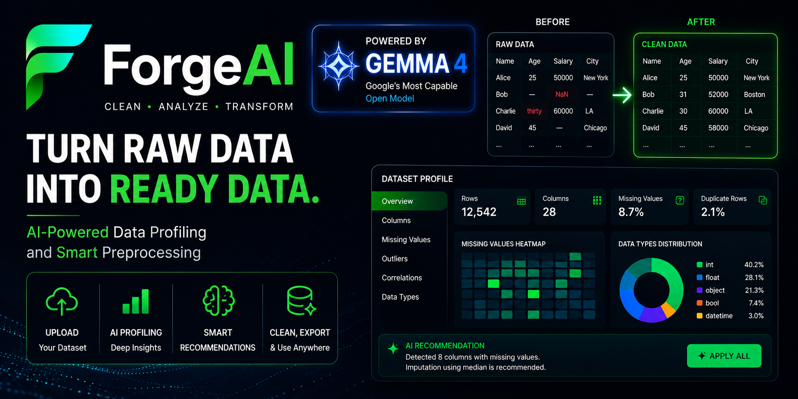

# 🚀 ForgeAI
### AI-Powered Dataset Preprocessing using **Gemma 4**



ForgeAI is an intelligent dataset preprocessing platform that helps data scientists, students, researchers, and ML engineers clean datasets in minutes instead of hours.

Rather than manually inspecting datasets, ForgeAI profiles uploaded CSV files, identifies data quality issues, and uses **Google Gemma 4** to recommend intelligent preprocessing actions before executing them safely.

Built for the **Gemma 4 Hackathon**.

---

# ✨ Features

- 📂 Upload CSV datasets
- 📊 Automatic dataset profiling
- ❤️ Dataset Health Score
- 🤖 AI-powered preprocessing recommendations using Gemma 4
- 👀 Human approval before execution
- ⚙️ Automatic preprocessing pipeline generation
- 📄 HTML preprocessing reports
- 💾 Download cleaned dataset
- 🧠 Generate reusable preprocessing Python code

---

# 🖼️ Demo Workflow

1. Upload a CSV dataset.
2. ForgeAI profiles the dataset.
3. Gemma 4 analyzes the dataset profile.
4. AI suggests preprocessing actions.
5. User reviews and approves actions.
6. ForgeAI cleans the dataset.
7. Download:
   - Cleaned CSV
   - HTML Report
   - Generated preprocessing pipeline

---

# 🧠 How Gemma 4 is Used

Gemma 4 is the core reasoning engine of ForgeAI.

It is responsible for:

- Understanding dataset characteristics
- Identifying preprocessing problems
- Suggesting intelligent cleaning strategies
- Explaining why each preprocessing action is recommended
- Generating preprocessing workflows

Gemma 4 is the primary AI model powering the application's decision-making pipeline.

---

# 🏗️ Project Structure

```
ForgeAI/
│
├── frontend/                # Next.js frontend
│
├── backend_rial/            # FastAPI backend
│
├── assets/
│   └── thumbnail.png
│
└── README.md
```

---

# ⚙️ Tech Stack

## Frontend

- Next.js
- React
- TypeScript
- Tailwind CSS

## Backend

- FastAPI
- Python
- Pandas
- NumPy
- Uvicorn

## AI

- Google Gemma 4

## Deployment

- Vercel
- Render

---

# 📦 Installation

## 1. Clone Repository

```bash
git clone https://github.com/<your-username>/ForgeAI.git

cd ForgeAI
```

---

# Backend Setup

Move into the backend.

```bash
cd backend_rial
```

Create a virtual environment.

Windows

```bash
python -m venv venv
venv\Scripts\activate
```

Linux / Mac

```bash
python3 -m venv venv
source venv/bin/activate
```

Install dependencies.

```bash
pip install -r requirements.txt
```

Create a `.env` file.

Example:

```env
OPENAI_API_KEY=YOUR_API_KEY
FRONTEND_URL=http://localhost:3000
```

Run backend.

```bash
uvicorn main:app --reload
```

Backend runs at

```
http://localhost:8000
```

---

# Frontend Setup

Open another terminal.

```bash
cd frontend
```

Install dependencies.

```bash
npm install
```

Create `.env.local`

```env
BACKEND_URL=http://localhost:8000
```

Run frontend.

```bash
npm run dev
```

Frontend runs at

```
http://localhost:3000
```

---

# 🚀 Usage

1. Open the web application.
2. Upload a CSV dataset.
3. Wait for AI analysis.
4. Review suggested preprocessing actions.
5. Approve desired actions.
6. Execute preprocessing.
7. Download:
   - Clean dataset
   - HTML report
   - Generated preprocessing pipeline

---

# 📂 Dependency List

## Backend

```
fastapi
uvicorn
pandas
numpy
python-dotenv
python-multipart
pydantic
openai
```

Install using

```bash
pip install -r requirements.txt
```

---

## Frontend

Main packages:

```
next
react
react-dom
typescript
tailwindcss
```

Install using

```bash
npm install
```

---

# 🔧 Configuration Files

## Backend

```
backend_rial/
    .env
    requirements.txt
```

Example `.env`

```env
OPENAI_API_KEY=YOUR_API_KEY
FRONTEND_URL=http://localhost:3000
```

---

## Frontend

```
frontend/
    .env.local
```

Example

```env
BACKEND_URL=http://localhost:8000
```

For production:

```env
BACKEND_URL=https://your-render-url.onrender.com
```

---

# 📊 Outputs

ForgeAI generates:

- ✅ Cleaned CSV
- 📄 HTML preprocessing report
- ⚙️ Python preprocessing pipeline
- 📈 Dataset health score
- 🤖 AI preprocessing recommendations

---

# 🌍 Deployment

Frontend:

- Vercel

Backend:

- Render

---

# 👥 Team

**Triarchy**

Built for the **Google Gemma 4 Hackathon**.

---

# 📜 License

This project is intended for educational and hackathon purposes.

---

# ❤️ Acknowledgements

- Google Gemma 4
- FastAPI
- Next.js
- Pandas
- Render
- Vercel
